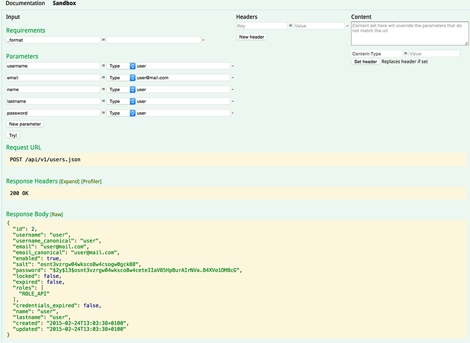

# Documentation #

This example project is based on Symfony Standard distribution. The project aims to show how to build powerful restful apis mainly with :

*  [FOSRestBundle](https://github.com/FriendsOfSymfony/FOSRestBundle) : This Bundle provides various tools to rapidly develop RESTful API's with Symfony2.
*  [FOSUserBundle](https://github.com/FriendsOfSymfony/FOSUserBundle) : Provides user management for your Symfony2 Project. Compatible with Doctrine ORM & ODM, and Propel.
*  [NelmioApiDocBundle](https://github.com/nelmio/NelmioApiDocBundle) : Generates documentation for your REST API from annotations.
*  [MopaWSSEAuthenticationBundle](https://github.com/phiamo/MopaWSSEAuthenticationBundle) : Symfony2 bundle to implement WSSE authentication.

# Installation #

Just clone the project and execute:

    curl -sS http://getcomposer.org/installer | php && php composer.phar install
    build/travis.sh

Remember to set the database password properly in *parameters.yml*.

Now you will able to list the resources at http://localhost/app_dev.php

# Checking the Restful API #

Nelmio API Doc provides you with a *sandbox* that you can use to check the controllers. There are services under @Secure interception that need authentication.

As an example, the following screenshot show the interface while posting a new user:

# Testing #

Just run phpunit from console:

    build/travis.sh
    phpunit -c build

